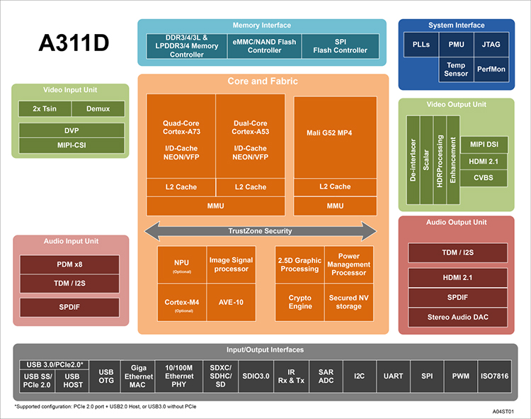

# [A311D](https://github.com/SoCXin/A311D)

#### [Vendor](https://github.com/SoCXin/Vendor) ：[amlogic](https://www.amlogic.cn/)
#### [Core](https://github.com/SoCXin/Cortex) ：[cortex A73](https://github.com/SoCXin/CA73)
#### [Level](https://github.com/SoCXin/Level) ：2.2GHz (NPU:INT8 5TOPS/ FP16 12.8GFLOPS)

## [芯片描述](https://github.com/SoCXin/A311D/wiki)

[A311D](https://github.com/SoCXin/A311D)=S922X+NPU，类似于RK3399PRO的“胶水方案” 满足了人工智能和物联网（AIoT）场景下的功能需求，外置挂载芯片占用面积会更大一些，但是算力的调整也更方便，可按需选择。

### [选型建议](https://github.com/SoCXin)

[A311D](https://github.com/SoCXin/A311D)主要针对家庭影音市场而非通用平台，对标[RK3399PRO](https://github.com/SoCXin/RK3399PRO)后发制人，相对[rock-chips](https://github.com/SoCXin/rock-chips)节奏较滞后，开源程度较低。

###  [SoC芯平台](http://www.SoC.Xin)
